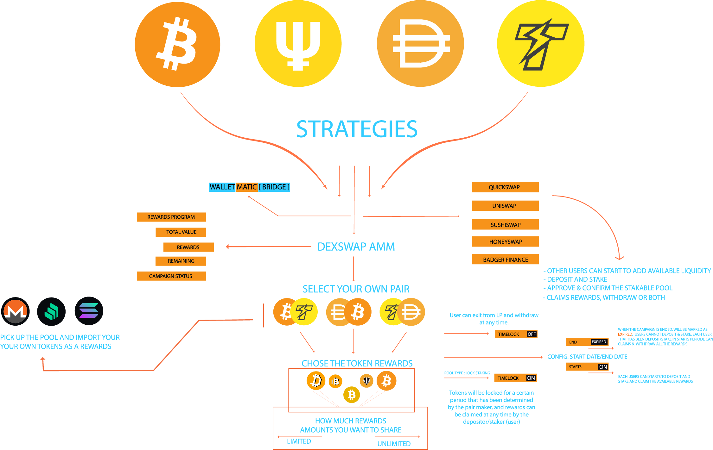
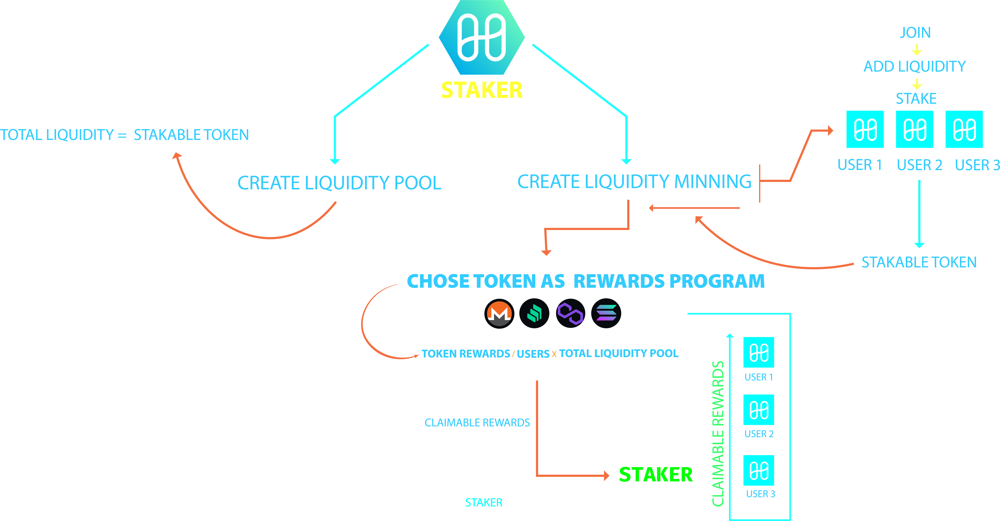

# **Harmony - Bridging TradFi To DeFi**

## Challenges: 

### *Track 1: Cross-Chain - “Liquidity” : https://gitcoin.co/issue/harmony-one/hackathon/18/100026313*


### **DEMO [Harmony Mainnet]** **[https://harmony-dexswap.netlify.app/](https://harmony-dexswap.netlify.app)**

### **VIDEO WORKFLOW** **https://www.youtube.com/watch?v=swRyarDEzyk**

### Implementing  Terra UST as a native currency & value for tracking liquidity minning & token rewards in Graphql/Subgraph, see:

**https://github.com/Agin-DropDisco/HARMONY_ONE/tree/main/graph-index#ust-track**

**https://github.com/Agin-DropDisco/HARMONY_ONE/blob/04fd17259f32201d84c974245fb14cec95265538/graph-index/src/commons/addresses.ts#L88**

**https://github.com/Agin-DropDisco/HARMONY_ONE/blob/04fd17259f32201d84c974245fb14cec95265538/graph-index/schema.graphql#L9**
 
**https://github.com/Agin-DropDisco/HARMONY_ONE/blob/04fd17259f32201d84c974245fb14cec95265538/graph-index/schema.graphql#L37**

### Implementing Terra UST in DexSwap Frontend

```jsx
const QUERY = gql`
  query {
    bundle(id: "1") {
      nativeCurrencyPrice
    }
  }
`

export function useNativeCurrencyUSTPrice(): { loading: boolean; nativeCurrencyUSTPrice: Price } {
  const nativeCurrency = useNativeCurrency()
  const { loading, error, data } = useQuery<{ bundle: { nativeCurrencyPrice: string } }>(QUERY)

  return useMemo(() => {
    if (loading) return { loading: true, nativeCurrencyUSTPrice: new Price(nativeCurrency, UST, '1', '0') }
    if (!data || error) return { loading: false, nativeCurrencyUSTPrice: new Price(nativeCurrency, UST, '1', '0') }
    return {
      loading: false,
      nativeCurrencyUSTPrice: new Price(
        nativeCurrency,
        UST,
        parseUnits('1', UST.decimals).toString(),
        parseUnits(new Decimal(data.bundle.nativeCurrencyPrice).toFixed(18), UST.decimals).toString()
      )
    }
  }, [data, error, loading, nativeCurrency])
}
```

```jsx
const QUERY = gql`
  query($id: ID!) {
    pair(id: $id) {
      id
      reserveUST
    }
  }
`

interface QueryResult {
  pair: { reserveUST: string }
}

export function usePairLiquidityUST(pair?: Pair | null): { loading: boolean; liquidityUST: CurrencyAmount } {
  const { loading, data, error } = useQuery<QueryResult>(QUERY, {
    variables: { id: pair?.liquidityToken.address.toLowerCase() }
  })

  return useMemo(() => {
    if (loading) return { loading: true, liquidityUST: ZERO_UST }
    if (!data || !data.pair || !data.pair.reserveUST || error) return { loading, liquidityUST: ZERO_UST }
    return {
      loading,
      liquidityUST: CurrencyAmount.ust(
        parseUnits(new Decimal(data.pair.reserveUST).toFixed(UST.decimals), UST.decimals).toString()
      )
    }
  }, [data, error, loading])
}
```


# DexSwap Finance ($DEXS)

Decentralized Protocol Optimizer for Multiple Exchanges


### Strategies Workflow
<p align="center">
 
 </P>

### User Workflow
<p align="center">
 
 </p>
 


## Address Harmony Mainnet

DexSwap Factory:  
[0xE77A7C836720897cd3fBd6c0C0067C5Ca278603F](https://explorer.harmony.one/address/0xE77A7C836720897cd3fBd6c0C0067C5Ca278603F)


DexSwap Staking:  
[0xFd9744bA0c2De4abf7CAb9E2dFdBdA1Ea0A9363F](https://explorer.harmony.one/address/0xFd9744bA0c2De4abf7CAb9E2dFdBdA1Ea0A9363F)


DexSwap FeeReceiver:  
[0x2340Fb341bAc3C1243123Deefac7209296A65f47](https://explorer.harmony.one/address/0x2340Fb341bAc3C1243123Deefac7209296A65f47)


DexSwap FeeSetter:  
[0x9A462BDfb4195C0394614008505EB0BEde044AE9](https://explorer.harmony.one/address/0x9A462BDfb4195C0394614008505EB0BEde044AE9)


DexSwap Router:  
[0x151c94151a38564b42670b5241fbaceb824e5281](https://explorer.harmony.one/address/0x151c94151a38564b42670b5241fbaceb824e5281)


DexSwap Deployer:  
[0x6CD5d036d1697A421F1dEE97c242A3F6C82A3F6d](https://explorer.harmony.one/address/0x6CD5d036d1697A421F1dEE97c242A3F6C82A3F6d)

